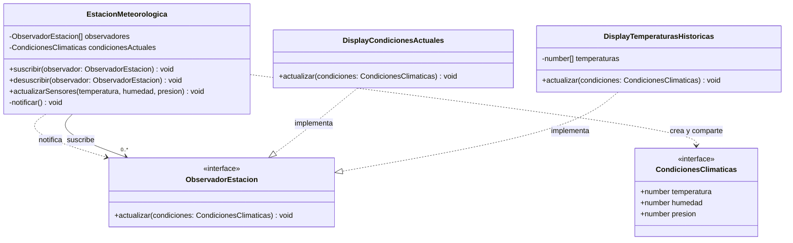

# Observer

## Intención

Definir una dependencia **uno a muchos** entre objetos para que, cuando el
estado de un objeto cambie, todos sus dependientes sean notificados y puedan
actualizarse automáticamente.

El objeto que mantiene el estado se conoce como **sujeto** u **observable**;
los objetos que reciben las notificaciones son los **observadores**.

## Problema que resuelve

Una aplicación puede necesitar que varias partes reaccionen al mismo cambio:
una pantalla debe mostrar la temperatura actual, otra debe actualizar un
historial y una tercera podría generar una alerta. Si el servicio del clima
conoce directamente a cada componente, queda fuertemente acoplado a ellos:

- Cada nuevo componente obliga a modificar el servicio.
- El servicio debe conocer detalles que pertenecen a la presentación o a
  otras responsabilidades.
- Resulta más difícil suscribir o quitar componentes dinámicamente.

## Cómo lo resuelve

1. Se define la interfaz `ObservadorClima`, que establece el método
   `actualizar(temperatura)` que todo observador debe implementar.
2. `ServicioClima` mantiene una colección de observadores y ofrece los
   métodos `suscribir` y `desuscribir`.
3. Cuando cambia la temperatura mediante `setTemperatura`, el servicio
   actualiza su estado, guarda el valor en el historial y notifica a todos
   los observadores.
4. Cada observador decide qué hacer con la notificación. El servicio no
   necesita conocer la implementación concreta de `MostrarTemperaturaActual`
   ni de `MostrarHistorial`.

## Ejemplo en este repo

`index.ts` simula un servicio meteorológico con dos observadores:

- `MostrarTemperaturaActual` informa la temperatura más reciente.
- `MostrarHistorial` consulta el servicio y muestra las últimas temperaturas
  registradas, con un máximo de 12 valores.

Primero se suscriben ambos observadores. Cada cambio de temperatura notifica
a los dos. Después se desuscribe `MostrarTemperaturaActual`; a partir de ese
momento, solo `MostrarHistorial` recibe las actualizaciones.

Ejecutar:

```bash
npm run pattern -- src/behavioral/observer/index.ts
```

o con el script corto:

```bash
npm run observer
```

## Prácticos

- [01 - Estación meteorológica](./exercises/01-estacion-meteorologica/)

El primer práctico modela una estación que recibe temperatura, humedad y
presión desde sus sensores. La estación notifica a un display de condiciones
actuales y a otro que conserva el historial de temperaturas.

Ejecutar:

```bash
npm run pattern -- src/behavioral/observer/exercises/01-estacion-meteorologica/index.ts
```

## Diagrama del práctico



## Cuándo usarlo

- Cuando un cambio de estado debe propagarse a varios objetos sin acoplar el
  sujeto a sus clases concretas.
- Cuando los observadores pueden aparecer, desaparecer o cambiar durante la
  ejecución.
- En interfaces reactivas, eventos de dominio, notificaciones y sistemas de
  publicación y suscripción simples.

## Cuándo evitarlo / riesgos

- Muchos observadores pueden generar una cadena de actualizaciones difícil
  de seguir o costosa de ejecutar.
- El orden de notificación puede afectar el resultado si los observadores
  tienen efectos secundarios.
- Si un observador falla durante la actualización, hay que decidir si se
  detiene la notificación o se continúa con los demás.
- Las suscripciones olvidadas pueden mantener objetos en memoria más tiempo
  del necesario; por eso es importante desuscribirlos cuando corresponda.

## Relación con otros patrones

- **Mediator**: centraliza la comunicación entre objetos; Observer permite
  que un sujeto notifique a muchos observadores sin conocer sus clases
  concretas.
- **Command**: puede usarse para representar una acción disparada como
  consecuencia de una notificación.
- **Chain of Responsibility**: ambos desacoplan al emisor de quienes
  procesan algo, pero Observer notifica a todos los suscriptores mientras
  Chain of Responsibility delega hasta que un eslabón maneja la solicitud.
