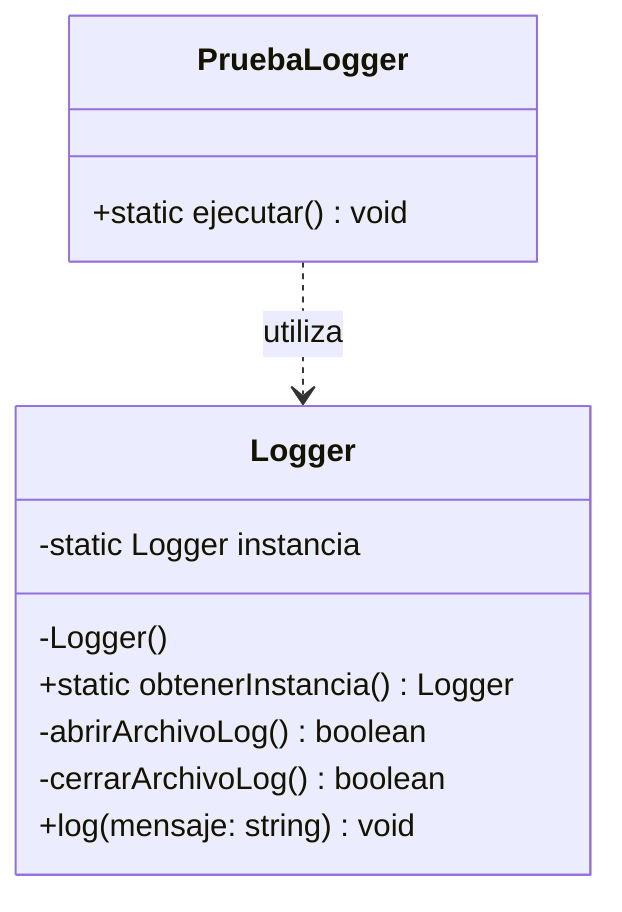

# Ejercicio 1: Logger como Singleton

El ejercicio transforma `Logger` para garantizar que exista una única
instancia y proveer un punto de acceso global mediante `obtenerInstancia()`.

## Diagrama de clases



Ejecutar:

```bash
npm run pattern -- src/creational/singleton/exercises/01-logger/index.ts
```
