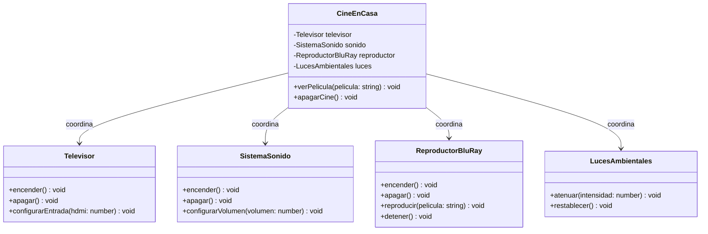

# Facade

## Intención

Proporcionar una **interfaz simplificada** frente a un conjunto de clases de
un subsistema complejo. En vez de que el cliente maneje directamente muchas
dependencias y pasos internos, la fachada expone métodos simples y de alto
nivel.

## Problema que resuelve

Una funcionalidad "simple" para el usuario suele requerir la coordinación de
muchos componentes: encender dispositivos, configurar opciones y respetar un
orden de ejecución. Si el cliente hace todo eso directamente, surgen
problemas:

- El código cliente queda **acoplado** a las clases internas del subsistema.
- El cliente debe conocer **pasos y detalles** que no le competen.
- Cualquier cambio interno (nuevo componente, otro orden, nueva
  configuración) obliga a **modificar a todos los clientes**.
- Repetir la misma secuencia en varios lugares duplica lógica y errores.

En resumen: se quiere una funcionalidad compleja, pero con una puerta de
entrada simple y estable.

## Cómo lo resuelve

1. Se define una clase **fachada** (`CineEnCasa`) que conoce a los
   componentes del subsistema (`Televisor`, `SistemaSonido`,
   `ReproductorBluRay`, `LucesAmbientales`).
2. La fachada expone métodos **de alto nivel** (`verPelicula(...)` y
   `apagarCine()`) que internamente coordinan la secuencia completa de
   operaciones sobre los componentes.
3. El cliente solo interactúa con la fachada y **nunca conoce** a los
   componentes internos ni el orden en que se encienden.
4. Si cambia la forma de trabajar del subsistema, solo se modifica la
   fachada; el cliente permanece intacto.

## Ejemplo en este repo

`index.ts` simula un cine en casa. Sin la fachada, el usuario tendría que
atenuar las luces, encender el televisor, configurar su entrada HDMI,
encender el sonido, ajustar el volumen, encender el reproductor y lanzar la
película, en el orden correcto y repitiéndolo cada vez.

Con `CineEnCasa` basta un solo método:

```ts
cine.verPelicula("El Padrino");
cine.apagarCine();
```

La fachada se encarga de todo lo demás y puede reutilizarse para reproducir
cuantas películas quiera sin repetir esa lógica.

Ejecutar:

```bash
npm run pattern -- src/structural/facade/index.ts
```

## Diagrama



## Cuándo usarlo

- Cuando se necesita una **interfaz simple** para acceder a un subsistema
  complejo, por ejemplo para que clientes o módulos no conozcan su
  implementación interna.
- Cuando el subsistema tiene **muchas dependencias** que conviene no exponer
  a cada cliente.
- Cuando se quiere estructurar el subsistema en **capas**: la fachada es el
  punto de entrada de cada capa y reduce el acoplamiento entre capas.
- Cuando se quiere **desacoplar** al código cliente de los cambios internos
  del subsistema.

## Cuándo evitarlo / riesgos

- La fachada puede volverse una **clase "todopoderosa"** que conoce de más y
  concentra demasiada responsabilidad.
- No debe ocultar la posibilidad de que clientes avanzados accedan a
  funcionalidades específicas que la fachada no expone.
- No reemplaza un mal diseño del subsistema: si los objetos internos están
  mal organizados, la fachada solo maquilla el problema.
- Es fácil caer en la tentación de crear fachadas que solo delegan sin aportar
  una simplificación real.

## Relación con otros patrones

- Un **Facade** simplifica una interfaz compleja; un **Adapter** traduce una
  interfaz a otra. Ambos agregan una capa, pero con distinta intención.
- **Abstract Factory** puede usarse junto con Facade para ocultar cómo se
  crean los objetos del subsistema que la fachada utiliza.
- **Mediator** centraliza la comunicación entre objetos, mientras que Facade
  define una interfaz unificada de acceso a un subsistema.
